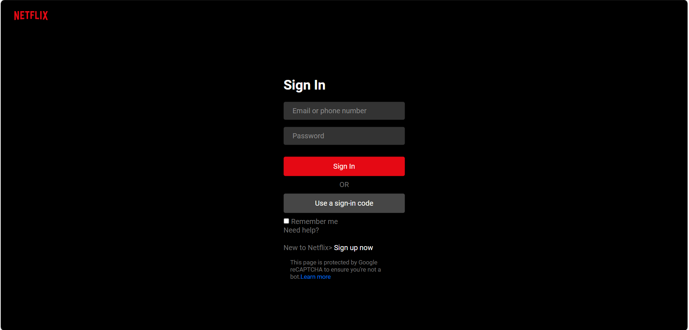

# Netflix Sign-In Page Clone

This project replicates the **Netflix sign-in page clone** using HTML and CSS. This mini project aims to practice web development skills by creating a visually appealing and responsive user interface similar to one of the most popular streaming platforms.

## 🔍 Project Overview

This project replicates the interface of the Netflix sign-in page, focusing on clean code, responsive design, and pixel-perfect styling. It serves as a practical exercise to deepen my understanding of front-end development basics and CSS layout techniques.

## 🚀 Features

- **Responsive Design**: Ensures compatibility with various screen sizes, providing a seamless experience across desktop and mobile devices.
- **Clean and Modern Layout**: Closely matches the visual style of the authentic Netflix sign-in page, incorporating common UI elements.
- **Custom Styling**: Utilizes CSS for custom styling, layout adjustments, hover effects, and responsiveness.

## 🛠️ Technologies Used

- **HTML**: For semantic structure and accessibility of the page content.
- **CSS**: For styling, positioning, and creating a visually engaging user interface.

## 📚 Key Learnings

- Creating structured and semantic HTML code.
- Implementing CSS styles to replicate real-world UIs.
- Developing responsive web designs that adapt to different screen resolutions.

## 📸 Project Preview

*An image of the project here to give a visual representation of the work:*



## 💻 How to Use

1. Clone this repository:
   ```bash
   git clone https://github.com/NoData01/Netflix_Sign_In_Page.git
